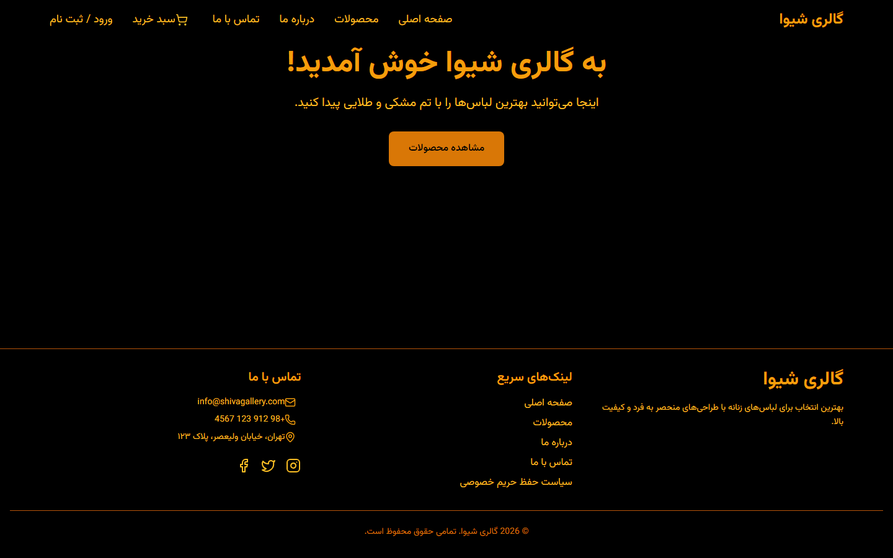

# Shiva Gallery — Women's Clothing Store

Full-stack e-commerce app for a women's clothing store, with a Django backend and a React frontend. Verified working by running both sides locally against the repo's own seeded database.

**[English](#english) | [فارسی](#فارسی)**

> A static front-end mockup of the same "Shiva Gallery" brand also exists at [shopping-website](https://github.com/alirezaalamshah/shopping-website).

---

## English

### Screenshot



### About

An online store for women's clothing with a real e-commerce data model: categories, homepage sliders, tags, products with batches/sizes/stock quantities and variants, reviews, user profiles with addresses, a cart, orders, and coupons.

### Tech Stack

**Backend** (`backend/`, Django project `shiva_gallery`, app `shop`)
- Django + Django REST Framework, JWT auth (`rest_framework_simplejwt`), session-based guest cart support
- `django-filter`, `django-cors-headers`, `django-extensions`
- SQLite (`db.sqlite3` is committed with real seed data — a fixture also exists at `backup.json`)

**Data model** (`shop/models.py`): `Category`, `Slider`, `Tag`, `Product` (with fixed and time-limited discount percentages), `ProductBatch`, `Size`, `SizeQuantity`, `ProductVariant`, `Review`, `UserProfile`, `Address`, `Cart`, `CartItem`, `Order`, `OrderItem`, `Coupon`.

**Frontend** (`frontend/ShivaGallery/`)
- React, state-based routing (no react-router — `currentPage` state in `App.jsx`)
- Tailwind-style utility classes, RTL, black/gold theme
- API base URL hardcoded to `http://127.0.0.1:8000/api` in `src/context/AuthContext.jsx`

### Getting Started

```bash
# Backend — db.sqlite3 already has seed data, migrate is optional
cd backend
pip install django djangorestframework django-filter django-cors-headers djangorestframework-simplejwt django-extensions pillow
python manage.py runserver 8000   # must be port 8000 — frontend hardcodes it

# Frontend
cd frontend/ShivaGallery
npm install
npm run dev
```

> Note: there's no `requirements.txt` in `backend/` — dependencies above were inferred from `INSTALLED_APPS`.

---

## فارسی

### تصویر


### درباره

یک فروشگاه آنلاین پوشاک زنانه با یک مدل داده‌ی واقعی فروشگاهی: دسته‌بندی‌ها، اسلایدر صفحه اصلی، تگ‌ها، محصولات با بچ/سایز/موجودی و تنوع رنگ، نظرات، پروفایل کاربر با آدرس‌ها، سبد خرید، سفارش‌ها و کد تخفیف.

### پشته فناوری

**بک‌اند** (`backend/`، پروژه‌ی Django با نام `shiva_gallery`، اپ `shop`)
- Django + DRF، احراز هویت JWT، پشتیبانی از سبد خرید مهمان با session
- `django-filter`، `django-cors-headers`، `django-extensions`
- SQLite (فایل `db.sqlite3` با داده‌ی واقعی کامیت شده؛ یک فیکسچر هم در `backup.json` هست)

**مدل داده** (`shop/models.py`): `Category`، `Slider`، `Tag`، `Product` (با تخفیف ثابت و تخفیف زمان‌دار)، `ProductBatch`، `Size`، `SizeQuantity`، `ProductVariant`، `Review`، `UserProfile`، `Address`، `Cart`، `CartItem`، `Order`، `OrderItem`، `Coupon`.

**فرانت‌اند** (`frontend/ShivaGallery/`)
- React، مسیریابی مبتنی بر state (بدون react-router)
- کلاس‌های یوتیلیتی شبیه Tailwind، راست‌به‌چپ، تم مشکی-طلایی
- آدرس API به‌صورت هاردکد `http://127.0.0.1:8000/api` در `src/context/AuthContext.jsx`

### راه‌اندازی

```bash
# بک‌اند — db.sqlite3 از قبل داده دارد، migrate اختیاری است
cd backend
pip install django djangorestframework django-filter django-cors-headers djangorestframework-simplejwt django-extensions pillow
python manage.py runserver 8000   # باید پورت 8000 باشد — فرانت‌اند این پورت را هاردکد کرده

# فرانت‌اند
cd frontend/ShivaGallery
npm install
npm run dev
```

> نکته: در `backend/` فایل `requirements.txt` وجود ندارد — وابستگی‌های بالا از `INSTALLED_APPS` استخراج شده‌اند.
